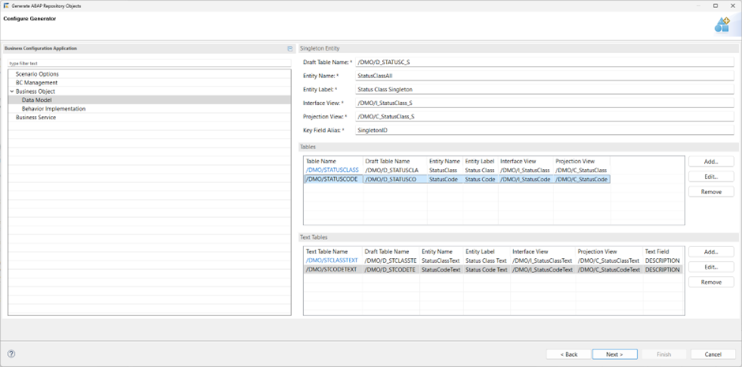
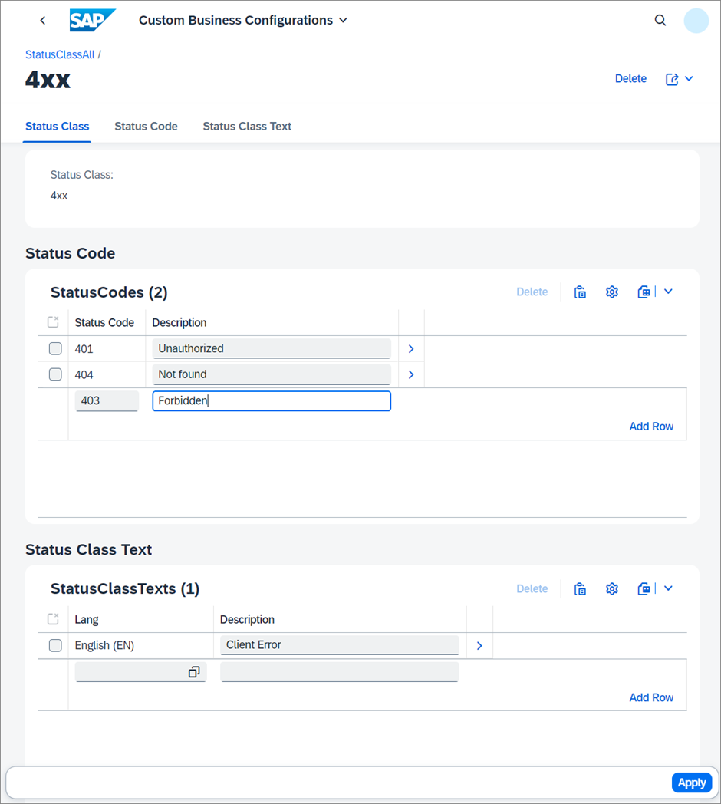

<!-- loio047e01c3bcdd4303a60b61364bd5b31d -->

# Generating a Business Configuration Maintenance Object with the Generate ABAP Repository Objects Wizard

You can create a business configuration maintenance object together with all related development objects on the basis of a database table by using the *Generate ABAP Repository Objects Wizard*.


<a name="loio047e01c3bcdd4303a60b61364bd5b31d__section_ymn_sbj_zsb"/>

## Context

Creating a Fiori app to maintain customizing tables involves many different objects that need to be created manually. On the basis of a database table, this wizard creates all the development objects that are required to maintain the content of this table and, optionally, the content of foreign key associated tables and text tables using the *Custom Business Configurations* app. If required, you can then, for example, add further functions or enhance the generated business object structure. As an alternative to using the app, you can also build your own custom SAP Fiori elements app based on the generated objects. This is described [in this blog entry](https://blogs.sap.com/2023/03/31/how-to-create-a-fiori-elements-app-for-a-rap-bo-with-transport-selection/).

For more information, see[Creating Business Configuration Apps with ABAP RESTful Application Programming Model and Custom Business Configurations App](https://help.sap.com/docs/btp/sap-business-technology-platform/creating-business-configuration-apps-with-abap-restful-application-programming-model-and-custom-business-configurations-app?version=latest). A tutorial on how to use this wizard and the *Custom Business Configurations* app is available [here](https://developers.sap.com/group.abap-env-factory.html).


<a name="loio047e01c3bcdd4303a60b61364bd5b31d__section_cqv_dcj_zsb"/>

## Prerequisites

The wizard distinguishes between three types of tables:

-   The basis database table in which context the wizard is executed

-   \(Optional\) Additional tables with a foreign key relation of type `#KEY` to the basis database table

-   \(Optional\) Text tables with a foreign key relationship of type `#TEXT_KEY` to one of the tables mentioned above


All tables must fulfill the following requirements:

-   have a client key field

-   have delivery class C

-   allow data maintenance

-   \(optional\) have a timestamp field with data element `ABP_LOCINST_LASTCHANGE_TSTMPL`. If the table doesn't contain this field, the concurrency control is not active


The basis databse table must also meet the following requirements:

-   have a timestamp field with data element `ABP_LASTCHANGE_TSTMPL`. For more information, see [RAP Reuse Data Elements](https://help.sap.com/docs/SAP_S4HANA_CLOUD/e5522a8a7b174979913c99268bc03f1a/84bd58e2b9354be4a7a1c91cb687815c.html). If the table doesn't contain this field, the entire ETag is handled by CDS entity `I_CstmBizConfignLastChgd`


The additional tables must also meet the following requirements:

-   Have a foreign key of type `#KEY` that fully matches the primary key of the base table


The text tables must also meet the following requirements:

-   have a language key field with type `LANG`

-   have a foreign key of type`#TEXT_KEY` that fully matches the primary key of one of the other tables


The software component of the target package and the table package must be changeable.


<a name="loio047e01c3bcdd4303a60b61364bd5b31d__section_isn_3dj_zsb"/>

## Procedure

The wizard can't overwrite existing objects or create only a subset of the objects. The generated objects will have the same ABAP language version as the target package.

1.  In your ABAP project, open the context menu for a database table and choose *Generate ABAP Repository Objects*.

2.  In the folder *Business Configuration Management*, select *Maintenance Object*. Choose *Next*. Enter the target package and choose *Next* again.

3.  In the *Configure Generator* page you can define the names and options for the generated objects. The wizard fills all required fields as a proposal based on the description of the basis table. Select *Next.*

4.  In the *Preview Generator Output* page, a preview list is available with the objects to be generated. Choose *Next*.

5.  Assign a transport request.

6.  Choose *Finish* to start the generation of the objects.

7.  After the generation process is complete, the generated *Business Configuration Maintenance Object* is shown.


### Procedure Results

The generated RAP business object has the following properties:

-   draft enabled, managed

-   authorization control based on authorization object `S_TABU_NAM` and the CDS view entity name of the basis table

-   concurrency control based on the table timestamp fields

-   integration of the BC transport API to validate and record changes on a customizing transport request

-   To enable mass editing and manual transport selection, a singleton root entity is part of the generated data model. For more information, see [here](https://help.sap.com/docs/BTP/923180ddb98240829d935862025004d6/f713ec52bcb8405ca9262918cffa5d25.html?version=latest).

-   internal numbering is used for key fields with `ABAP` type `raw(16) (UUID)`


<a name="loio047e01c3bcdd4303a60b61364bd5b31d__section_n5h_fmc_55b"/>

## Scenario Options


### Add Copy Action

Select this to include a *Copy* action in the generated app. With this factory action a copy of the selected entry will be created.


### Add Deprecate Actions

Select to include a Deprecate and Invalidate action in the generated app. The table must have a field `CONFIGDEPRECATIONCODE` with the data element `CONFIG_DEPRECATION_CODE`. With this action a selected entry can be deprecated or invalidated. If a foreign key check is executed on a deprecated or invalidated check table entry, the check returns a warning \(deprecated\) or error \(invalidated\). If this option is selected, the user can delete a table entry only if it is in draft mode and the entry was never active.


### Add Data Consistency Check

Select this option to include a *Validation* for the *Prepare* draft action in the generated app, which checks the consistency of field inputs with:

-   domains with fixed values

-   foreign keys where `@AbapCatalog.foreignKey.screenCheck : true`


### Copy Parameter Entity

If the option *Add Copy Action* is selected, an abstract entity for the user input is generated. Provide a name for the abstract entity. This is not necessary if all key fields except the client field of the basis table have type `ABAP type raw(16)`.


### Transport Selection

Select *Manual* to include the action *Select Transport* in the generated app. With this action, you can select an existing customizing transport request before saving the configuration changes.


<a name="loio047e01c3bcdd4303a60b61364bd5b31d__section_h5s_qf1_rxb"/>

## BC Management


### BC Maintenance Object

Enter the name of the maintenance object.


### Transport Object

You can specify the name of a transport object. If specified, a transport object of type `Individual Transaction` is generated. Configuration changes are recorded under this transport object instead of as a `TABU`.


<a name="loio047e01c3bcdd4303a60b61364bd5b31d__section_hvr_cyn_vyb"/>

## Data Model


### Tables

This list must contain the basis database table. You can add any additional tables that fulfill the requirements that should be part of the generated RAP business object.


### Text Tables

You can add any text table that fulfills the requirements that are to be part of the generated RAP business object.


<a name="loio047e01c3bcdd4303a60b61364bd5b31d__section_hmt_jyn_vyb"/>

## Example

Our example scenario consists of four editable entities with a 1:N cardinality at each level:

-   Status Class

-   Status Class Text

-   Status Code

-   Status Code Text


The corresponding database table definitions are as follows:

Status Class:

> ### Sample Code:  
> ```
> @EndUserText.label : 'Status Class'
> @AbapCatalog.enhancement.category : #NOT_EXTENSIBLE
> @AbapCatalog.tableCategory : #TRANSPARENT
> @AbapCatalog.deliveryClass : #C
> @AbapCatalog.dataMaintenance : #ALLOWED
> define table /dmo/statusclass {
>   key client            : abap.clnt not null;
>   key status_class_id   : /dmo/status_class_id not null;
>   last_changed_at       : abp_lastchange_tstmpl;
>   local_last_changed_at : abp_locinst_lastchange_tstmpl;
> }
> 
> ```

Status Class Text

> ### Sample Code:  
> ```
> @EndUserText.label : 'Status Class Text'
> @AbapCatalog.enhancement.category : #NOT_EXTENSIBLE
> @AbapCatalog.tableCategory : #TRANSPARENT
> @AbapCatalog.deliveryClass : #C
> @AbapCatalog.dataMaintenance : #ALLOWED
> define table /dmo/stclasstext {
>   key client            : abap.clnt not null;
>   key lang              : abap.lang not null;
>   @AbapCatalog.foreignKey.keyType : #TEXT_KEY
>   key status_class_id   : /dmo/status_class_id not null
>     with foreign key /dmo/statusclass where client = /dmo/stclasstext.client and status_class_id = /dmo/stclasstext.status_class_id;
>   description           : /dmo/description;
>   local_last_changed_at : abp_locinst_lastchange_tstmpl;
> 
> ```

Status Code:

> ### Sample Code:  
> ```
> @EndUserText.label : 'Status Code'
> @AbapCatalog.enhancement.category : #NOT_EXTENSIBLE
> @AbapCatalog.tableCategory : #TRANSPARENT
> @AbapCatalog.deliveryClass : #C
> @AbapCatalog.dataMaintenance : #ALLOWED
> define table /dmo/statuscode {
>   key client            : abap.clnt not null;
>   @AbapCatalog.foreignKey.keyType : #KEY
>   key status_class_id   : /dmo/status_class_id not null with foreign key /dmo/statusclass where client = /dmo/statuscode.client and status_class_id = /dmo/statuscode.status_class_id;
>   key status_code_id    : /dmo/status_code_id not null;
>   local_last_changed_at : abp_locinst_lastchange_tstmpl;
> }
> 
> ```

Status Code Text:

> ### Sample Code:  
> ```
> @EndUserText.label : 'Status Code Text'
> @AbapCatalog.enhancement.category : #NOT_EXTENSIBLE
> @AbapCatalog.tableCategory : #TRANSPARENT
> @AbapCatalog.deliveryClass : #C
> @AbapCatalog.dataMaintenance : #ALLOWED
> define table /dmo/stcodetext {
>   key client            : abap.clnt not null;
>   key lang              : abap.lang not null;
>   key status_class_id   : /dmo/status_class_id not null;
>   @AbapCatalog.foreignKey.keyType : #TEXT_KEY
>   key status_code_id    : /dmo/status_code_id not null with foreign key /dmo/statuscode where client = /dmo/stcodetext.client and status_class_id = /dmo/stcodetext.status_class_id and status_code_id = /dmo/stcodetext.status_code_id;
>   description           : /dmo/description;
>   local_last_changed_at : abp_locinst_lastchange_tstmpl;
> }
> 
> ```

If you execute the wizard in the context of the table /DMO/STATUSCLASS, the text table /DMO/STCLASSTEXT is automatically added to the list of text tables in the data model section.

Due to the foreign key definition, you can also add the Status Code and Status Code Text table manually.



The resulting table maintenance application then looks like this:



